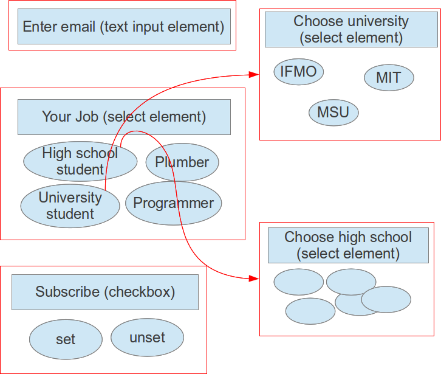
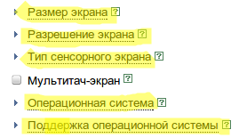
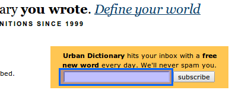
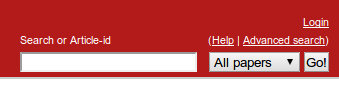
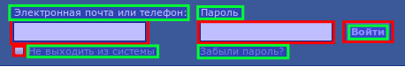
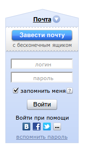

## Описание работы
В общем-то у меня происходит:

1. Извлечение ссылок, все предельно тупо, извлекаются только ссылки типа `<a href="...">`. Понятно, что для чего-то более нетривиального нужно как-то парсить js.
2. Извлечение форм и генерация данных для них.

### Извлечение форм

Под формой имеется в виду что-то, что независимо от остальных элементов на странице, и, соответственно, может тестироваться отдельно от всего остального, что сильно уменьшает число тестов. Почти всегда все, что находится в теге `<form>`, подходит под это определение (однако есть ислючения, например, сайт `vk.com`, об этом будет написано дальше), можно также попытаться конструировать формы из элементов ввода, лежащих вне тега `<form>`:

 

Будем извлекать формы из страницы рекурсивно, тогда когда мы перейдем к обработке тега `<some tag>`, обнаружим что у нас есть «настоящая» форма (тег `<form>`) и несколько элементов ввода, которые тоже объединим в форму.

Итак, получили поддеревья HTML-структуры страницы, соответствующие формам. Вообще говоря, формы и способ отправки данных серверу бывает разный (можно, например, ткнуть кнопку «submit», а можно -- нажать какую-то клавишу, и т.д.). Я обрабатываю только случай формы вида «ввели данные, нажали кнопку в форме», за это отвечает класс `forms.InputAndClickButtonForm`. 

Далее, я предполагаю, что после загрузки страницы при работе с ней (т.е. вводе данных), ничего в нее динамически не подгружается (насколько я понимаю, это AJAX), а у элементов только меняются стили (в частности, мне интересен только случай «элемент стал видим/скрыт»). Здесь можно сделать какое-нибудь предположение вроде «видимость элемента зависит только от одного параметра» (чаще всего это так), тогда получаем граф-лес элементов ввода:

То есть, если мы хотим выбрать «MIT» из списка «Choose university», обязательно надо выбрать «University student» в списке «Your job», иначе элемент выбора университета будет невидимым.

Понятно, что вообще говоря, чтобы обнаружить такие зависимости, надо некоторое время исследовать страницу, т.е. перепробовать все поля в элементах с конечным числом вариантов (списки, чекбоксы, радиокнопки и т.п.), попробовать ввести хоть что-то в поля с бесконечным числом вариантов (т.е. поля ввода текста и паролей), и потыкать на различные активные элементы (ссылки, кнопки). Тут проблем несколько:

 1. В webdriver нет возможности поймать событие вроде «элемент пропал/стал видим», впрочем, учитывая, что элементов на странице не так много, можно тупо хранить отображение из элементов ввода в boolean, и просто каждый раз искать их и проверять, изменилось ли состояние.
 2. Если вдруг после тыка на какую-нибудь кнопку начинается загрузка другой страницы, нет возможности узнать, что она началась (кроме сравнения изначальной и конечной сслыки, и то не факт -- страница может тупо загрузиться заново).
 3. В webdriver нет возможности соответственно остановить или запретить переход на другую страницу.
 4. Некоторые активные элементы вообще невозможно определить, не разбирая JS (например, на странице [яндекс-маркета](http://market.yandex.ru/guru.xml?CMD=-RR=0,0,0,0-VIS=70-CAT_ID=6427101-EXC=1-PG=10&hid=6427100) подчеркнутые пунктиром элементы -- активные, чего не скажешь по их HTML коду:

    > 

 5. По ссылке типа `<a href="...">` также невозможно понять, приведет ли она к загрузке новой страницы, например, аттрибут `href` ссылки «войти» на той же странице на первый взгляд должен вести на другую страницу, а он только отображает форму поверх текущей.

По этим причинам я не смог добавить поддержку зависимостей между элементами, возможно, webdriver не подходит для такого? (хотя может быть, я чего-то не так понял в документации, которая у него, кстати, просто ужасная), и работаю только с видимыми изначально элементами в предположении что никакие элементы внезапно не пропадут (впрочем, для большинства страниц так и есть).

### Извлечение описаний для элементов ввода
Сразу приведу пример проблемы с описанием элемента ввода:

Как назвать поле, которое слева от кнопки «subscribe», не сразу понятно даже человеку, только как-то по тому что кнопка называется «subscribe» можно догадаться, что от нас хотять email.

Но так уж и быть, предположим, что где-то рядом с элементом располагается надпись к нему, благо чаще всего так и есть. Мой алгоритм получения описания примерно такой:

* Если что-то есть в атрибуте `title` (насколько я понимаю, отвечает за всплывающую подсказку), очень вероятно, что оно совпадет с надписью, соответствующей элементу.
* Часто можно извлечь информацию из атрибута `value`, в особенности для кнопок.
* Выпадающие списки можно найти по варианту по умолчанию (атрибут `selected`).
* Элемент и надпись могут разделять общий тег:

    > `<some tag>Label1: <input element1></some tag>`

    > `<some tag>Label2: <input element2></some tag>`

    Этот случай обрабатывается подъемом к родительскому элементу, проверкой есть ли какой-то текст внутри него, и так поднимаемся, пока не обнаружим какой-то текст. 

* Плохой случай -- элемент и надпись не разделяют общий тег, такая верстка очень распространена:

    > `
Label1:
 <input element1>`
    
    > `
Lavel2:
 <input element2>`

    В этом случае вообще говоря непонятно, что делать, потому что надпись может быть и слева, а может быть и справа, в общем у меня он обрабатывается так же, как предыдущий случай, то есть будет выводить кучу надписей сразу с переводами на новые строки и т.д. Я бы мог обнаруживать этот случай и говорить, что ничего не буду генерировать, так как не могу определить надпись, но решил, что пусть хоть так будет.

* И самый фиговый и тоже довольно распространенный случай:

    > 

    Надпись «Search or Article-id» на сайте arxiv.org в HTML-коде насположена на несколько тегов позади собственно поля, поэтому вообще неясно, как программно можно обнаружить что чему соотвествует, не видя как оно рендерится. Такое тоже у меня никак не обрабатывается.

## Альтернативный способ извлечения описаний к полям ввода

Альтернативой анализу HTML кода для извлечения форм и описаний к элементам ввода может быть распознавание скриншота страницы. Я почти не знаком с алгоритмами распознавания чего-либо, но раз распознают рукописный текст, распознать чекбоксы, радиокнопки, поля ввода, выпадающие списки и блоки текста находящиеся рядом должно быть очень просто. Тогда получаем что-то такое:

Во-первых, становится просто определять форму как скопление рядов стоящих элементов ввода, то есть отпадает проблема поиска форм, сделанных не с помощью тега `<form>`, а с помощью js, или даже flash. 

Во-вторых, становится проще искать надписи -- понятно что если у элемента есть надпись, она где-то рядом с ним, тогда задача состоит в том, чтобы сопоставить элеменам ввода одну из стоящих рядом надписей. Можно представить элементы и надписи как доли графа, и сопоставить стоимости ребра из элемента в надпись какой-нибудь функции. Можно предположить какие-то логичные свойства:

 * Чем ближе элемент и надпись, тем больше шанс что они относятся друг к другу.
 * Если надпись внутри элемента, но они почти наверняка относятся друг к другу (во всяком случае, элемент легко можно по такой надписи отыскать)
 * Надпись скорее расположена слева, чем справа (хотя у чекбоксов чаще справа), и скорее сверху, чем снизу.

Ну и дальше применить какой-нибудь алгоритм поиска паросочетания максимального/минимального веса.

Насколько я понимаю, по координате элемента на экране определить, к какому тегу html он относится, можно (Inspector в chrome так умеет, во всяком случае), но webdriver, видимо, этого не умеет.

## Целесообразность заполнения полей человеком

Мы генерируем инструкцию для человека, возможно, будет проще если тыканье в кнопки/ссылки и заполнение полей будет все же делать программа, а человек будет только наблюдать, и фиксировать когда происходит что-то странное, тогда отпадают проблемы:

 * Необходимости генерации нормальных описаний к полям.
 * Вводить человеку какие-то нетрививальные последовательности символов -- совершенно неудобно и медленно.
 * К примеру, в элементе ввода `<input type="image">` входные данные -- координата клика, нет никакой возможности сообщить тестеру, куда точно надо ткнуть, программа может это тупо передать в запросе.
 * Если на экране есть несколько полей/кнопок/ссылок с одинаковым названием, нет возможности сообщить тестеру, в какую из них ткнуть. 

## Некоторые странности webdriver, с которыми я не умею бороться:

* Если ввести какой-нибудь некорректный url, например, "http://aaa", драйвера пытаются автодополнять его до "http://aaa.com", либо просто отображают стандартную страницу, говорящую о том, что такого URL нет, которую webdriver проглатывает как корректную. Таким образом не особо понятно, как обрабатывать некорректный ввод URL. Более того, если ввести какой-нибудь треш вроде "dfsfsf", даже без протокола, WebDriver бросает какое-то странное исключение, ничего не говорящее о том, что именно плохо.
* `HtmlUnitDriver` вообще не считает, что какие-то элементы могут быть скрытыми, то есть `isDisplayed()` всегда `true`. Еще он ужасно засоряет stderr какими-то проблемами с парсингом CSS.
* На странице vk.com есть кнопка с `id="reg_bar_btn"`, которая на странице не отображается, однако код `driver.findElement(By.id("reg_bar_btn")).isDisplayed()` возвращает `true`. (хотя, может, и верстальщик виноват)
* Там же в форме входа кнопка отправки, которая `<input type="submit">` не отображается и находится вообще фиг знает где, хотя webdriver считает, что отображается. (опять же, может, проблема в верстке)
* И наоборот, какая-то непонятная проблема на страницах Яндекса: и `ChromeDriver`, и `FirefoxDriver` считают, что кнопки не отображаются (т.е. `isDisplayed() == false`), хотя, например, «Войти» замечательно отображается:

    > 

## Некоторые вещи, которые я не понимаю в верстке:

* Я вообще не очень понимаю принцип, по которому верстают формы, иногда на одной и той же странице некоторые формы в теге `<form>`, а в остальных -- элементы просто вразнобой. Более того, есть сайты, на которых данные, находящиеся в теге `<form>`, отправляются кнопкой, которая вообще находится вне этого тега (например, `vk.com`).
* Хорошей идеей для верстальщика было бы использовать аттрибут «for» тега label, который придуман специально чтобы указывать, к чему относится надпись, только почему-то его все равно никто не использует.
* Также есть много замечательных HTML5 элементов вроде email, datetime, tel и т.д., но их все равно почему-то не используют, вместо `month` юзают `select` с числами от 1 до 31, и т.д. Собственно, поэтому я не стал создавать для них классы и генераторы, хотя добавляются они относительно легко.

Возможно это все происходит потому-то страницы генерируются как-то по-хитрому и автоматически, но я не удивлюсь, если все же проблема в верстальщиках.

## Некоторые замечания по поводу моего кода:
* Я ловлю все исключения в `WebPageTester.main` и просто вывожу стектрейс, все равно тот, кто пользуется тестером, будет вызывать его как отдельную программу и не сможет обработать исключения.
* Сначала HTML страница представляет у меня просто дерево из элементов `WebNode`, некоторые из которых я по ходу программы преобразую в `InputElement`. Для этого я использую метод `makeInput` фабрики `InputElementFactory`. Также иногда нужно просто определять, является ли элемент элементом ввода с помощью метода `isInput` (это часто быстрее чем делать элемент и проверять, что он, например, не `null`). Тут приходится делать в некотором смысле дублирование кода и неясно, как держать методы `isInput` и `makeInput` согласованными. Возможно, стоит использовать рефлексию, а, может, есть какой-то паттерн для подобного, в общем, я не знаю.
* Я вообще не уверен, что правильно использую здесь паттерн фабрики, так как это делаю чуть ли не в первый раз, но вроде получилось нормально. Но во всяком случае, если кто-нибудь решит, например, сделать не `UniformInputGeneratorFactory`, а какую-нибудь другую, он сможет легко отнаследоваться от `InputGeneratorFactory` и написать что-то свое. С другой стороны, мне не очень нравится, что приходится использовать приведение типов вниз, но, может, этого и не избежать.
